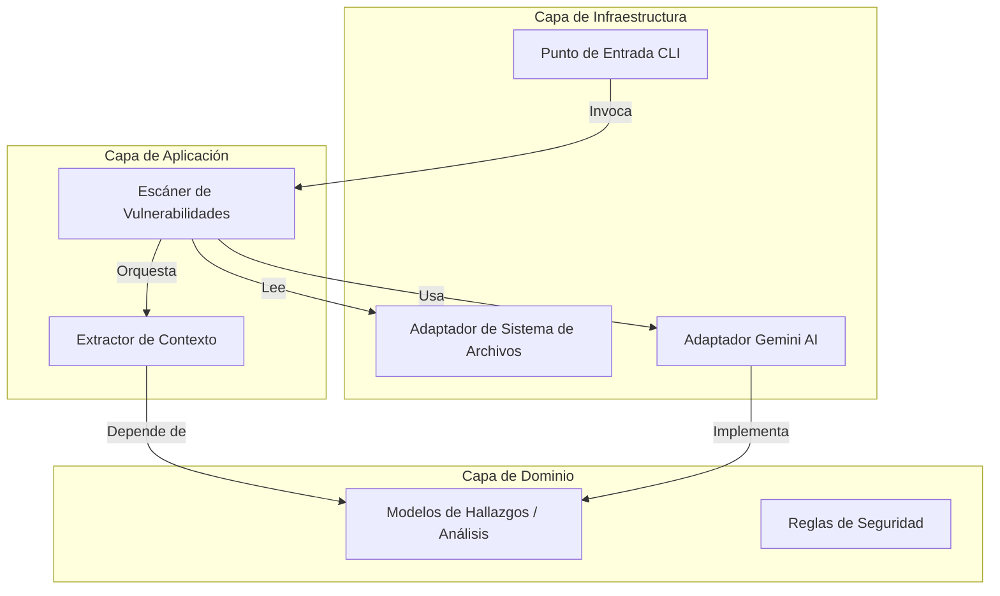

# AI SAST Triage MeLi

> **Motor de Triage de Seguridad Automatizado impulsado por LLMs y Análisis de Contexto Estático.**


## ⚡ Visión General

**AI SAST Triage MeLi** aborda la problemática de la alta tasa de "ruido" (falsos positivos) inherente a las herramientas tradicionales de Pruebas de Seguridad de Aplicaciones Estáticas (SAST). En pipelines de CI/CD empresariales, la validación manual de miles de hallazgos se convierte en un cuello de botella que ralentiza la entrega de valor.

Este motor actúa como un **Ingeniero de Seguridad Senior** automatizado, aprovechando **Gemini 2.5 Flash** para realizar un análisis semántico de las rutas de código. A diferencia de los escáneres simples basados en expresiones regulares (regex), este sistema comprende el contexto del flujo de datos para distinguir entre **Verdaderos Positivos** y **Falsos Positivos** con un alto grado de confianza.

### Capacidades Principales

*   **Análisis Sensible al Contexto:** Extrae y analiza la ruta de ejecución específica desde la fuente (*source*) hasta el sumidero (*sink*), no solo líneas aisladas.
*   **Detección de Sanitización:** Identifica lógica de validación compleja, *prepared statements* y rutinas de codificación que las herramientas SAST tradicionales suelen pasar por alto.
*   **Triage Automatizado:** Clasifica los hallazgos y proporciona consejos de remediación accionables, reduciendo la carga cognitiva de los equipos de AppSec.
*   **Nativo de CI/CD:** Construido como una herramienta CLI sin estado (*stateless*) y contenerizada, diseñada para ejecución efímera en pipelines (ej. Fury, Jenkins, GitHub Actions).

---

## 🏗️ Arquitectura

La solución implementa principios de **Clean Architecture** para garantizar que la lógica de dominio central permanezca desacoplada de dependencias externas como el proveedor de LLM o el sistema de archivos. Este diseño facilita las pruebas y permite el intercambio sencillo de modelos de IA (por ejemplo, cambiar de Gemini a GPT-5 o modelos locales con Ollama) sin refactorizar la lógica de negocio.



### Decisiones de Ingeniería

*   **Ventana de Contexto Inteligente:** En lugar de enviar archivos completos al LLM (lo que introduce ruido y latencia), implementamos un **Extractor de Contexto**. Este componente recupera dinámicamente el bloque de código relevante que rodea al *source* y al *sink*, optimizando el uso de tokens y enfocando la atención del modelo en la ruta de la vulnerabilidad.
*   **Chain of Thought (CoT) Prompting:** No solicitamos un simple "Sí/No". El prompt del sistema impone un marco de razonamiento: *Rastrear Flujo de Datos -> Identificar Sanitización -> Determinar Explotabilidad -> Veredicto*. Esto reduce significativamente las tasas de alucinación.
*   **Diseño Asíncrono:** La arquitectura está preparada para escenarios de alto rendimiento utilizando `asyncio`, permitiendo el análisis concurrente de múltiples hallazgos (optimización futura).

---

## 📂 Estructura del Proyecto

```text
.
├── app/
│   ├── domain/           # Lógica de negocio central y modelos de datos
│   ├── application/      # Casos de uso y lógica de orquestación
│   └── infrastructure/   # Adaptadores externos (API Gemini, E/S Archivos, Reportes HTML)
├── sample/               # Artefactos de prueba (Código vulnerable de muestra)
├── main.py               # Punto de entrada CLI (Typer)
├── Dockerfile            # Definición del contenedor para CI/CD
└── requirements.txt      # Archivo de bloqueo de dependencias
```

---

## 🚀 Uso

### Prerrequisitos

*   **Docker** (Recomendado) o Python 3.11+
*   Una `GEMINI_API_KEY` válida en tu archivo `.env`.

### 1. Ejecución con Docker


```bash
# 1. Construir la imagen
docker build -t meli-ai-scanner .

# 2. Ejecutar el escaneo
docker run --rm \
  --env-file .env \
  -v $(pwd)/sample:/app/sample \
  -v $(pwd):/app/output \
  meli-ai-scanner --output /app/output/report_docker.json
```

### 2. Desarrollo Local

```bash
# Instalar dependencias
pip install -r requirements.txt

# Ejecutar el escáner
python main.py --findings ./sample/findings.json --output report.json
```

---

## 📊 Artefactos de Salida

La herramienta genera dos artefactos por cada ejecución:

1.  **`report.json`**: Un archivo que contiene los metadatos originales del hallazgo enriquecidos con el análisis de la IA (Estado, Puntuación de Confianza, Razonamiento). Ideal para la ingesta en sistemas de seguimiento de defectos (Jira, DefectDojo).
2.  **`report.html`**: Un tablero legible para una auditoría rápida por parte de ingenieros de seguridad.
---